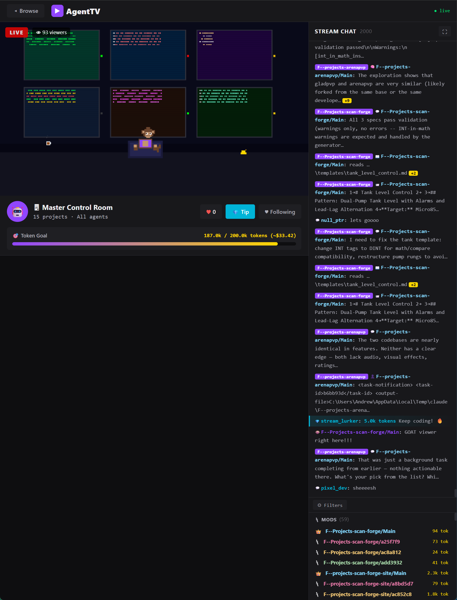

# AgentsTV

[](https://pypi.org/project/agent-replay/)
[](https://opensource.org/licenses/MIT)
[](https://www.python.org/downloads/)

Turn your AI coding agent sessions into a Twitch-style pixel art stream.

<!-- TODO: Add demo GIF here -->


## Quick Start

```bash
pip install agent-replay
agent-replay
```

That's it. The dashboard auto-discovers session logs and opens in your browser.

## About

The idea started as a simple TUI to replay Claude Code session logs. I built the first version, went to bed, and woke up wanting something completely different: a Twitch-style live dashboard with pixel art characters, LLM-powered chat, and streaming overlays. The full web app was built and published in about 12 hours.

Built with Claude Code. I made the architectural decisions and directed the implementation across Python, JavaScript, HTML, and CSS.

## Usage

```bash
# Launch the web dashboard (opens browser automatically)
agent-replay

# Options
agent-replay --port 8420          # Custom port (default: 8420)
agent-replay --host 0.0.0.0      # Bind to all interfaces (default, enables LAN access)
agent-replay --no-browser         # Don't auto-open browser
agent-replay --public             # Redact secrets for public sharing
agent-replay --low-power          # Reduce LLM batch sizes for laptops
```

The dashboard auto-discovers Claude Code session logs from `~/.claude/projects/`. Override with `AGENTSTV_DATA_DIR=/path/to/logs`.

## Features

### Dashboard

Browse all Claude Code sessions as Twitch-style channel cards. Each card shows a live pixel art thumbnail with actual code from the session, project name, branch, agent count, event count, and live/offline status. A Master Control Room view aggregates all active sessions into a single multi-monitor scene.

### Pixel Art Webcam

Each session gets a unique procedurally generated coding scene with:
- A character with idle animations (sipping drinks, stretching, looking around, scratching head, leaning forward)
- Dynamic monitor content cycling between code, terminal, file tree, and debug views
- Monitors display actual code snippets from agent events
- Desk decorations: coffee with steam, cats that stretch, plants that sway, lamps with moths, rubber ducks
- Window scenes with rain, shooting stars, clouds, city skylines
- Keyboard keys light up during typing, flash red on errors, rainbow on completion

The character reacts to agent events in real-time:
- **Error** — desk shakes, red ! above head, skull on monitor, BSOD flash
- **Complete** — fist pump, gold sparkles, confetti, checkmark on monitor
- **Spawn** — purple rings radiate outward
- **Think** — thought bubble dots, hand on chin
- **User** — wave at camera, speech bubble
- **Bash** — lightning bolt above keyboard

### Code Overlay

When agent events occur, a code preview panel appears in the top-right corner showing the event type (color-coded), file path or command, and a code snippet or command output. Auto-hides after a few seconds.

### Chat Sidebar

A dual-pane chat layout splits the sidebar into **Viewer Chat** (LLM-generated reactions) and **Agent Log** (real agent events). The divider is draggable. Every agent action (file edits, bash commands, tool calls, etc.) appears as a chat message with type-specific badges and colored names. Click any message to expand and see the full content. Click "Ask about this" to ask the LLM about a specific event. Chat logs can be exported as .txt files via the export button or `E` shortcut.

### LLM Integration

AgentsTV optionally uses a local or cloud LLM to generate dynamic content. Supports Ollama (local), OpenAI, and Anthropic Claude as providers. All LLM features can be toggled on/off with the brain icon in the top bar. When LLM is off, viewer chat falls back to hardcoded messages and the narrator stops. Inactive sessions automatically skip LLM calls and use fallback messages only.

#### Viewer Chat

Simulated Twitch viewers react to what the agent is doing. Messages are generated by the LLM in parallel batches for fast buffer fill and appear every 3-10 seconds (1-3 seconds in Master Control Room). Random viewer tips, reaction chances, and chat speed are all configurable via Tuning settings. When LLM is off, a large pool of context-aware fallback messages keeps the stream lively.

#### Interactive Chat

Type a question in the chat input bar to ask about what the agent is doing. The LLM responds with 1-2 sentences focused on the actual code, file, or command. The input stays typeable while waiting for a response so you can draft your next message. You can also click "Ask about this" on any expanded event to ask about that specific action.

#### Narrator Bot

A play-by-play commentator (`caster_bot`) provides esports-style narration. Frequency is configurable via Tuning settings (default ~20s). Appears with a gold border and microphone badge. Only active when LLM is enabled (no hardcoded fallback).

#### Stream Title

Auto-generated from recent agent activity. Scans the last 5 events to detect the dominant activity type (Coding, Terminal, Planning, Research) and programming language (from file extensions), combined with the branch name. Updates live as new events arrive. Example: `Coding · Python · main`.

#### Reasoning Control

For Ollama models that support `/no_think` (Qwen3, Cogito), viewer chat, narrator, and reaction prompts automatically disable internal reasoning to reduce latency. Interactive chat keeps thinking enabled for higher quality explanations.

#### LLM Configuration

Configure via CLI flags or the settings gear icon:

```bash
# Ollama (default, local)
agent-replay --llm ollama --ollama-model qwen3:14b

# OpenAI
agent-replay --llm openai --openai-key sk-... --openai-model gpt-4o-mini

# Anthropic Claude (cloud)
agent-replay --llm anthropic --anthropic-key sk-ant-...

# Low-power mode for laptops (smaller batches, less frequent LLM calls)
agent-replay --low-power

# Disable LLM entirely
agent-replay --llm off
```

Or set environment variables: `AGENTSTV_LLM`, `AGENTSTV_OLLAMA_URL`, `AGENTSTV_OLLAMA_MODEL`, `AGENTSTV_OPENAI_KEY`, `AGENTSTV_OPENAI_MODEL`, `AGENTSTV_ANTHROPIC_KEY`, `AGENTSTV_ANTHROPIC_MODEL`.

The settings panel (gear icon) lets you switch providers, pick from locally available Ollama models, enter API keys, and select a hardware profile (Desktop GPU / Laptop / Cloud Only) that auto-suggests appropriate models and buffer sizes.

#### Tuning

The settings panel includes a collapsible "Tuning" section to adjust frontend behavior without touching code. All values persist in `localStorage`.

| Setting | Range | Default | Effect |
|---|---|---|---|
| Chat Speed | Slow / Normal / Fast | Normal | Viewer message interval (5-15s / 3-10s / 1-3s) |
| Narrator Frequency | 5-120s | 20s | How often caster_bot narrates |
| Tip Chance | 0-50% | 15% | Chance of a viewer tip per message cycle |
| Reaction Chance | 0-100% | 50% | Chance viewers react to your chat messages |
| Chat Buffer Size | 3-25 | 5 | How many LLM messages to pre-fetch |
| Code Overlay Duration | 5-60s | 15s | How long the code overlay stays visible |

### Master Control Room

Aggregates all active sessions into a single view with a dynamic wall of monitors that scales with active project count (2x1 for 1-2 projects up to 4x3 for 10-12), status LEDs, ceiling alert light on errors, a console desk with keyboard typing animation, a blinking server rack, a wall clock, and a manager character scanning monitors from a comfy chair.

### Sound Effects

Audio cues for agent events using Web Audio API: keystrokes during file edits, error buzzer, completion chime, chat message pop, spawn whoosh. Mute/unmute via the speaker button in the top bar. Preference persists in localStorage.

### Session Replay

Replay completed sessions with full playback controls. Play/pause, seek to any point via the timeline scrubber, and adjust speed (0.5x to 8x). Events are fed back through the pixel art engine and chat log in order, so you see exactly what happened during a session. The live WebSocket is disconnected during replay to avoid mixing old and new events.

### Clip Recording

Record WebM clips of the pixel art canvas via `canvas.captureStream()`. Click the record button to start/stop. The recording captures the canvas at 15 fps and downloads a `.webm` file when stopped. Useful for sharing interesting moments or agent reactions.

### OBS Browser Source Overlay

A standalone overlay page at `/overlay.html` designed for OBS Studio and other streaming software. Add it as a Browser Source with a transparent background to composite the pixel art scene, code overlay, chat panel, and stream alerts over your stream. Includes a LIVE badge and session name. Connect to any session via query parameter.

### Keyboard Shortcuts

Press `?` to show a shortcut overlay. Available shortcuts: `Esc` (back/close), `M` (mute/unmute), `F` (fullscreen chat), `Space` (pause auto-scroll), `T` (toggle theme), `E` (export chat), `S` (split chat).

### Dark / Light Theme

Toggle between dark and light themes via the sun/moon button in the top bar. Uses CSS variables for full-page theming. Preference persists in localStorage.

### Stream Alerts

Overlay toast notifications for key events: errors, task completions, agent spawns, file creates. Slide in from the top-right, stack up to 3, and auto-dismiss after 4 seconds.

### Dashboard Search and Sort

Search bar filters sessions by project name, branch, or slug. Sort dropdown orders by most recent, most events, or most agents.

### Public Streaming

Run with `--public` to share your coding sessions. Server-side redaction scrubs sensitive data before it leaves the machine:

**Redacted:** API keys, tokens, passwords, bearer tokens, JWTs, GitHub PATs, Slack tokens, AWS keys, long base64 strings (40+ chars), full file paths (reduced to filenames), session file paths (hashed to opaque IDs).

**Visible:** Project names, branch names, agent names, event types and timing, code structure on monitors (with secrets scrubbed), token counts and costs.

To expose on the web via Cloudflare + Nginx Proxy Manager:

1. Run: `agent-replay --host 0.0.0.0 --public --no-browser`
2. Nginx Proxy Manager: add proxy host pointing to your server IP:8420, enable WebSocket support, request SSL cert
3. Cloudflare DNS: A record to your IP (proxied), enable WebSockets in Network settings, SSL mode Full (strict)

### Live Updates

WebSocket connections push new events in real-time. The dashboard refreshes session status every 10 seconds. Individual session views poll for changes every 2 seconds and append new events without rebuilding the entire log.

## Architecture

```
agent_replay/
  __init__.py  # Version string
  __main__.py  # python -m agent_replay entrypoint
  server.py    # FastAPI server, WebSocket live updates, REST API, --public redaction
  parser.py    # JSONL parsing -> normalized event stream (cached with mtime invalidation)
  models.py    # Event, Agent, Session, SessionSummary dataclasses
  scanner.py   # Session discovery — scans ~/.claude/projects/ (cached with 5s TTL)
  llm.py       # LLM providers (Ollama/OpenAI/Anthropic), viewer/narrator/interactive chat

web/
  index.html      # Dashboard + session view layout
  style.css       # Twitch-inspired dark/light theme
  favicon.svg     # Browser tab icon
  app.js          # Entry point — imports and initializes all modules
  state.js        # Global state, constants, tuning, event bus
  utils.js        # Shared utilities (HTML escaping, formatting)
  pixelEngine.js  # Pixel art rendering, character, decorations, reactions
  chat.js         # Chat rendering, viewer chat queue, narrator, interactive input
  dashboard.js    # Dashboard view, session grid, search/filter/sort
  session.js      # Session stream view, code overlay, uptime timer
  master.js       # Master control room, multi-monitor layout
  settings.js     # Settings modal, LLM toggle, tuning controls
  router.js       # URL hash routing, view transitions
  sound.js        # Sound effects via Web Audio API
  shortcuts.js    # Keyboard shortcut overlay and handlers
  alerts.js       # Stream alert toast notifications
  theme.js        # Dark/light theme toggle
  clips.js        # WebM clip recording via canvas.captureStream
  replay.js       # Session replay/playback with timeline controls
  overlay.html    # OBS Browser Source overlay (standalone page)
  overlay.js      # OBS overlay entry point and rendering
  overlay.css     # OBS overlay styles (transparent background support)
```

### API Endpoints

| Endpoint | Description |
|---|---|
| `GET /api/sessions` | List all discovered sessions |
| `GET /api/session-preview/{id}` | Lightweight preview for dashboard thumbnails |
| `GET /api/session/{id}` | Full parsed session data |
| `GET /api/master` | Merged events from all recent sessions |
| `GET /api/settings` | Current LLM configuration |
| `PUT /api/settings` | Update LLM configuration |
| `GET /api/ollama-models` | List locally available Ollama models |
| `POST /api/chat` | Interactive chat (ask about agent activity) |
| `GET /api/viewer-chat/{id}` | Get a generated viewer chat message |
| `POST /api/viewer-react` | Generate viewer reactions to a user chat message |
| `GET /api/narrator/{id}` | Get a narrator commentary message |
| `WS /ws/session/{id}` | Live event stream for a session |
| `WS /ws/master` | Live event stream for all active sessions |
| `WS /ws/dashboard` | Live session list updates |

## Dependencies

- [FastAPI](https://fastapi.tiangolo.com/) >= 0.104
- [Uvicorn](https://www.uvicorn.org/) >= 0.24
- [httpx](https://www.python-httpx.org/) >= 0.25

## Supported Formats

- **Claude Code** JSONL transcripts (full support)
- **Codex CLI** session logs (experimental)
- **Gemini CLI** session logs (experimental)

## Contributing

Contributions are welcome! AgentsTV is MIT-licensed and open to PRs.

```bash
git clone https://github.com/andrewle8/AgentsTV.git
cd AgentsTV
pip install -e .
agent-replay --no-browser
```

Areas where help is especially welcome:
- Additional agent format parsers (Copilot CLI, Aider, etc.)
- Custom pixel art themes and character skins
- Mobile layout improvements
- OBS overlay enhancements

## License

MIT
